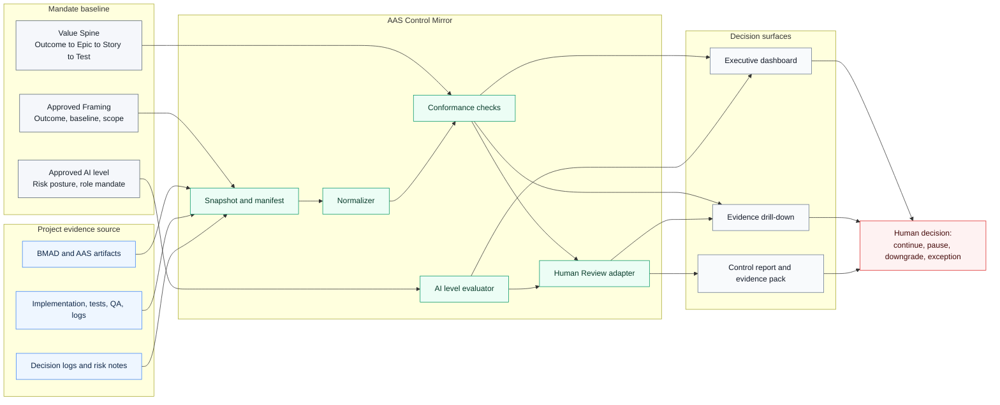
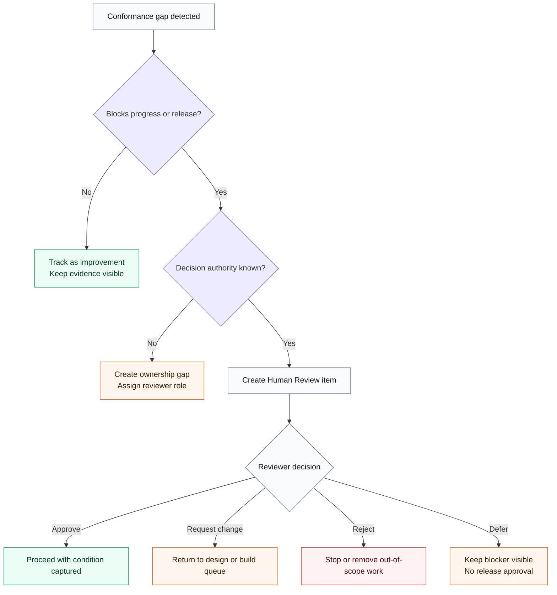
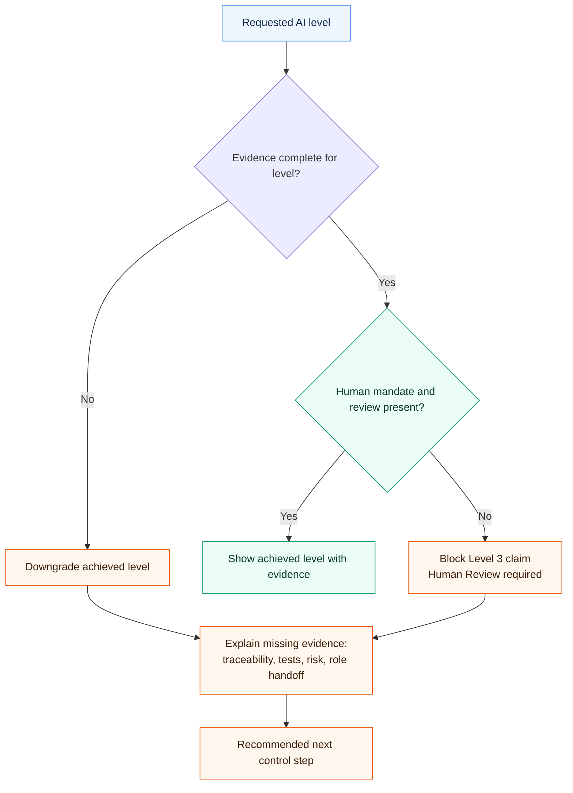
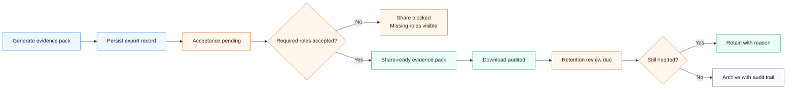
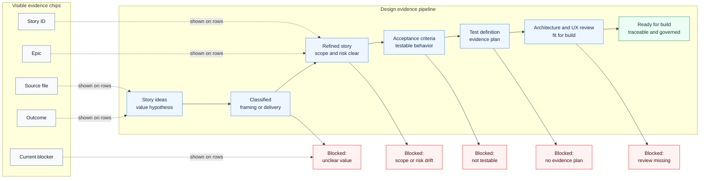
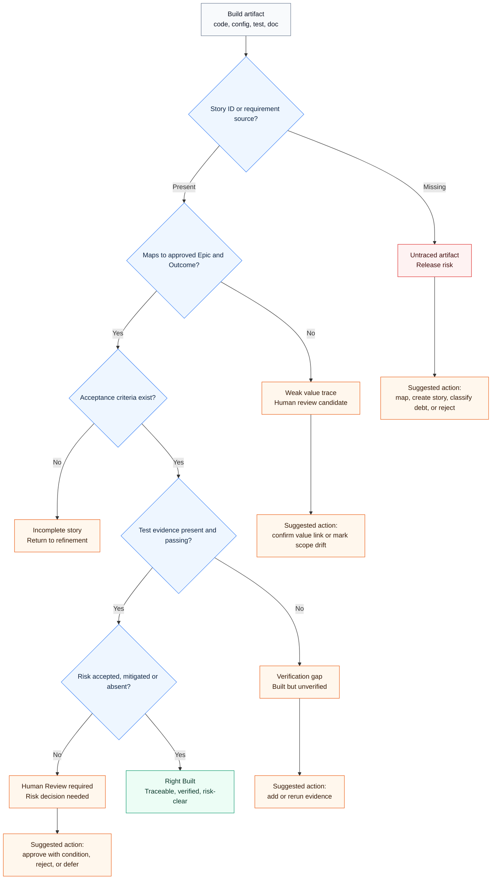
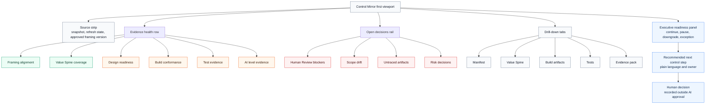
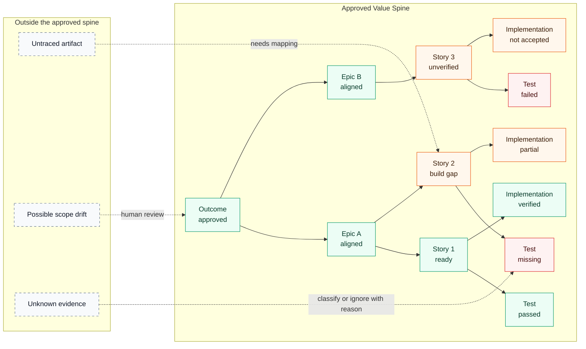

# AAS Control Mirror — BMAD Reference Pack

**Purpose**
This file packages the intended Outcome, Epics, User Stories, acceptance criteria, diagrams and BMAD test instructions for a new AAS Companion capability: **AAS Control Mirror**.

The pack is designed to be referenced by BMAD/AAS/SDD agents during analysis, design and build.

---

## 1. Executive Summary

**AAS Control Mirror** is a parallel control function in AAS Companion that reads BMAD/AAS design and build artifacts from a project source, normalizes them into AAS concepts, and cross-references them against the currently approved Framing and Value Spine.

It answers seven executive questions:

1. Are we designing the right thing against approved Framing?
2. Are we building the right thing against Outcome → Epic → Story → Test?
3. How far have Design and Build progressed?
4. Which artifacts lack traceability?
5. What evidence supports the requested AI Acceleration Level?
6. What gaps require Human Review?
7. What is the actually achieved AI level based on evidence?

**Strategic differentiation:**
AAS Companion should not only receive output from BMAD or downstream AI tools. It should independently verify whether that output still follows Framing, Value Spine, AI level, risk, human mandate and test requirements.

---

## 2. Recommended BMAD Execution Mode

### Recommendation

Use **individual BMAD agents / role sequence** for the main test, not Party Mode.

### Why

Control Mirror is a governance-heavy capability. It must test whether agents preserve separation between:

* Analyst interpretation
* Product/value validation
* UX/journey implications
* Architecture and AI delivery design
* Development planning
* QA/AQA review
* Reporting and evidence packaging

Party Mode is useful for brainstorming and broad coverage, but the primary test should verify role discipline, handoffs, downgrade logic and evidence-based reporting.

### Suggested execution approach

1. Run **Party Mode only for discovery or ideation**, if desired.
2. Then run **role-based BMAD sequence**:

   * Analyst
   * Product / PM / Value Owner proxy
   * UX Designer
   * Solution / AI Delivery Architect
   * Developer
   * QA / AQA
   * Tech Writer / Reporter
3. Require each role to produce or update its own artifact.
4. Require the final report to state whether execution was actual multi-agent execution or simulated role reasoning.

### Rule

If the same AI system performs multiple roles, it must disclose this as **simulated role reasoning**, not independent multi-agent execution or independent QA approval.

---

## 3. Should diagrams and screenshots be included?

### Include diagrams

Yes. Include the diagrams as text-based Mermaid diagrams in the reference file.

Reason:

* BMAD agents can read and reason over Mermaid diagrams.
* Diagrams remain versionable in Git.
* They can be updated by agents.
* They are better than static screenshots for design/build agents.

### Do not rely on screenshots as the primary source

Screenshots can be useful for executive communication, but they should not be the primary instruction source for BMAD agents.

Recommended approach:

* Include **Mermaid diagrams** in this file.
* Add screenshots later as optional visual references in a separate `/docs/visuals/` folder or in a presentation.
* Do not let screenshots replace structured acceptance criteria, data model, conformance rules or test definitions.

---

## 4. Product Outcome

### Outcome ID

`OUT-CM-001`

### Outcome Statement

AAS Companion shall provide a parallel control function that verifies whether BMAD/AAS design and build artifacts remain aligned with approved Framing, Value Spine, AI Acceleration Level, risk posture and test evidence, enabling delivery leaders and mandate holders to make evidence-based decisions about continuing, pausing, downgrading or releasing AI-accelerated work.

### Value Intent

Increase trust, control and auditability in AI-accelerated delivery by making it visible whether downstream design and build outputs are still building the right thing, with the right mandate, right traceability and sufficient evidence.

### Baseline Hypothesis

Without Control Mirror, downstream BMAD/design/build artifacts may drift from approved Framing, lack Story/Test traceability, overstate achieved AI level, or require manual review across multiple files and logs.

### Expected Business Effect

* Faster governance review of AI-assisted delivery.
* Reduced risk of untraced or out-of-scope implementation.
* Better evidence for Level 2 and Level 3 AI Acceleration claims.
* Clearer Human Review decisions.
* Stronger executive confidence in AI-accelerated delivery.

### Primary Users

* Value Owner
* Delivery Lead
* AI Delivery Architect (AIDA)
* AI Quality Authority (AQA)
* Solution Architect
* Product Owner / Service Owner
* Executive Sponsor

---

## 5. Scope

### In Scope

* New AAS Companion view: `Control Mirror` or `Delivery Conformance`.
* Project source registration through upload, folder snapshot, repo root or manual artifact upload.
* Artifact scanning and manifest creation.
* Refresh based on changed files where supported.
* Normalization of BMAD/AAS artifacts into AAS concepts.
* Cross-reference against approved Framing.
* Design progress dashboard.
* Build conformance dashboard.
* Test evidence coverage.
* Requested vs achieved AI level evaluation.
* Human Review item generation.
* Control report generation.

### Out of Scope for MVP

* Full VS Code extension.
* Real-time file watching.
* Deep parsing of every possible CI/CD log format.
* Guaranteed interpretation of all proprietary BMAD variants.
* Automated release approval.
* AI acceptance of risk.

### Hard Boundaries

* AI must not approve release.
* AI must not accept residual risk.
* AI must not override approved scope-out.
* AI must not claim Level 2 or Level 3 without required evidence.
* Untraced runtime/application artifacts must be treated as delivery or release risk until classified.

---

## 6. Executive UX Quality Bar and Control Diagrams

Control Mirror must read as an evidence cockpit, not as a reporting page. The first screen should let a mandate holder answer four questions without scrolling:

1. What source snapshot is being judged?
2. What is aligned, weak, blocked or unknown?
3. Which human decisions are required before progress or release?
4. What is the safest next control step?

UX rules:

* Use source paths, snapshot ids and evidence counts directly in drill-downs so every score is explainable.
* Pair every red or amber state with a plain-language reason and a next action.
* Keep executive summary compact; push evidence detail into tabs, tables and trace panels.
* Never make aggregate scores look like approval. Approval remains a human decision.
* Show requested AI level and achieved AI level side by side, with downgrade reasons visible.
* Treat unknown evidence as risk, not as neutral empty space.
* Make untraced artifacts visibly outside the Value Spine so scope drift is impossible to miss.

### System Boundary and Trust Model



### Human Review Decision Flow



### AI Level Evidence and Downgrade Logic



### Evidence Pack Lifecycle



---

# 7. Epics and User Stories

---

## Epic CM-01 — Project Source and Artifact Snapshot

### Epic Outcome

Users can register or upload a project source once and refresh it over time so that AAS Companion can evaluate downstream artifacts without repeated manual imports.

---

### Story CM-01.1 — Connect project root

**As a** Delivery Lead
**I want** to connect a BMAD/AAS project root or upload a project snapshot
**so that** AAS Companion can scan design and build artifacts without repeated manual imports.

#### Acceptance Criteria

```gherkin
Given an active AAS project exists
When I open Control Mirror
Then I can register a project source as one of:
  | Source type |
  | Uploaded zip |
  | Folder snapshot |
  | Git/repository root |
  | Manual artifact upload |

Given I register a project source
When the scan starts
Then the system creates a snapshot with:
  | snapshot id |
  | scan time |
  | source type |
  | detected folders |
  | detected files |
  | parsing status |
```

#### Notes for BMAD agents

Do not start implementation before identifying source types, security constraints, browser limitations and how local files can realistically be accessed.

---

### Story CM-01.2 — Refresh project snapshot

**As a** Delivery Lead
**I want** to refresh the connected project source
**so that** only new or changed artifacts are reprocessed.

#### Acceptance Criteria

```gherkin
Given a previous snapshot exists
When I click Refresh
Then the system compares current files against the previous snapshot

And each file is classified as:
  | unchanged |
  | new |
  | modified |
  | deleted |
  | unreadable |

And unchanged files reuse previous parse results
And the dashboard recalculates conformance based on the new snapshot
```

#### Constraint

The user should not need to re-import the same files manually unless the source type does not support refresh.

---

### Story CM-01.3 — Create artifact manifest

**As an** AIDA
**I want** each scanned file to be registered in an artifact manifest
**so that** every design/build artifact has source, type and traceability metadata.

#### Acceptance Criteria

```gherkin
Given project files are scanned
When the artifact manifest is created
Then each artifact includes:
  | file path |
  | file name |
  | artifact type |
  | source hash |
  | last modified time if available |
  | detected Story-ID |
  | detected Epic |
  | detected Outcome |
  | detected AI level |
  | parsing confidence |
  | lineage status |
```

#### Artifact Types

* Framing Source
* Design Artifact
* Architecture Artifact
* UX Artifact
* Delivery Story
* Implementation Note
* Test Evidence
* QA Review
* AI Risk Ledger
* Decision Log
* Workflow Log
* Final Report
* Unknown Artifact

---

## Epic CM-02 — AAS Normalization

### Epic Outcome

Scanned BMAD/AAS artifacts are mapped into canonical AAS concepts so they can be compared against Framing, Value Spine, risk and test evidence.

---

### Story CM-02.1 — Normalize BMAD artifacts into AAS concepts

**As an** AQA
**I want** BMAD artifacts to be normalized into AAS concepts
**so that** they can be compared against Framing and Value Spine.

#### Acceptance Criteria

```gherkin
Given BMAD files are scanned
When the normalizer runs
Then it maps recognized artifacts into AAS entities:
  | BMAD / file content | AAS entity |
  | PRD or product brief | Framing/Design Evidence |
  | Architecture document | Architecture Evidence |
  | UX notes | Journey/UX Evidence |
  | Story files | Delivery Story Candidate |
  | Dev notes | Implementation Evidence |
  | Test reports | Test Evidence |
  | QA notes | AI Review Evidence |
  | Risk log | AI Risk Ledger |
  | Decision notes | Decision Log |
```

#### Rule

Original source must never be overwritten. Normalized output must keep lineage.

---

### Story CM-02.2 — Detect Story Ideas versus Delivery Stories

**As a** Product Owner
**I want** the system to distinguish framing-level Story Ideas from implementation-ready Delivery Stories
**so that** build does not start from weak framing inputs.

#### Acceptance Criteria

```gherkin
Given a scanned artifact contains a story-like item
When the system classifies it
Then it must classify it as one of:
  | Framing Story Idea |
  | Candidate Delivery Story |
  | Exploration Story |
  | Epic Candidate |
  | Acceptance Criteria Candidate |
  | Journey / UX Context |
  | Out of Scope / Deferred |

And a Framing Story Idea must not be treated as build-ready

And implementation readiness requires:
  | linked Outcome |
  | linked Epic |
  | Story-ID or proposed Story-ID |
  | value intent |
  | expected behavior |
  | acceptance criteria |
  | test definition |
  | AI usage scope |
```

---

## Epic CM-03 — Framing Cross-reference

### Epic Outcome

Control Mirror can evaluate whether design and build artifacts remain aligned with the currently approved Framing version.

---

### Story CM-03.1 — Compare design artifacts against approved Framing

**As a** Value Owner
**I want** design artifacts to be compared against the approved Framing
**so that** I can see whether design still supports the agreed outcome.

#### Acceptance Criteria

```gherkin
Given an approved Framing version exists
And design artifacts have been scanned
When Control Mirror runs the cross-reference
Then each design artifact is evaluated against:
  | Outcome |
  | Problem statement |
  | Baseline |
  | Scope |
  | Constraints |
  | AI Acceleration Level |
  | Risk profile |
  | Epics |
  | Story Ideas |

And the system produces a Framing Alignment score
And artifacts with weak or missing alignment are flagged
```

#### Output Statuses

* Aligned
* Partially aligned
* Weak value alignment
* Potential scope drift
* Out of scope
* Needs human review

---

### Story CM-03.2 — Detect scope drift

**As a** Delivery Lead
**I want** the system to detect scope drift in design or build artifacts
**so that** unapproved work does not silently enter delivery.

#### Acceptance Criteria

```gherkin
Given a scanned artifact introduces new functionality
When the functionality is not linked to approved scope
Then it is flagged as Potential Scope Drift

Given the artifact affects data, security, architecture, dependencies, external services, cost, UX-critical behavior or release risk
Then the issue severity is at least Medium

Given the artifact conflicts with explicit scope-out
Then the issue severity is High
And the issue must be sent to Human Review
```

---

### Story CM-03.3 — Detect mismatch between requested and evidenced AI level

**As an** AIDA
**I want** the system to compare requested AI level with actual evidence
**so that** the final status does not overstate Level 2 or Level 3 compliance.

#### Acceptance Criteria

```gherkin
Given the requested AI level is Level 2
Then the system checks for:
  | requirements baseline |
  | implementation map |
  | decision log |
  | AI Risk Ledger |
  | AI-review |
  | test evidence |
  | final delivery report |

Given the requested AI level is Level 3
Then the system additionally checks for:
  | role handoffs |
  | workflow log |
  | AI Delivery Blueprint |
  | AAS Evidence Pack |
  | actual vs simulated execution statement |
  | QA/AQA independence statement |
  | downgrade rule evaluation |

If required evidence is missing
Then the system recommends:
  | proceed at requested level |
  | proceed with controls |
  | downgrade |
  | pause |
  | request exception approval |
```

---

## Epic CM-04 — Design Progress Dashboard

### Epic Outcome

Users can see how far design has progressed from Story Ideas to build-ready Delivery Stories.

---

### Story CM-04.1 — Show design processing progress

**As a** Delivery Lead
**I want** to see how far design has progressed from Story Ideas to build-ready Delivery Stories
**so that** I know what can safely move into Build.

#### Acceptance Criteria

```gherkin
Given design artifacts have been scanned
When I open Design Progress
Then I see counts for:
  | Story Ideas |
  | classified items |
  | refined Delivery Stories |
  | Stories with acceptance criteria |
  | Stories with test definition |
  | Stories with architecture review |
  | Stories with UX review |
  | Stories ready for build |
  | blocked Stories |
```

#### Status Model

* Not started
* Classified
* In refinement
* Design ready
* Blocked
* Ready for build

---

### Story CM-04.2 — Visualize design pipeline

**As a** Product Owner
**I want** a visual design pipeline
**so that** I can see where work is stuck.

#### Acceptance Criteria

```gherkin
Given design items exist
When I open the design pipeline view
Then items are grouped by processing stage:
  | Story Idea |
  | Classified |
  | Refined Story |
  | Acceptance Criteria |
  | Test Definition |
  | Architecture / UX Review |
  | Ready for Build |
  | Blocked |
```

#### Diagram



---

## Epic CM-05 — Build Conformance

### Epic Outcome

Users can see whether implementation artifacts are correctly traced, verified and risk-cleared against approved AAS structure.

---

### Story CM-05.1 — Determine whether build artifacts are right-built

**As a** Value Owner
**I want** to see which built artifacts are traceable to approved Outcome/Epic/Story/Test
**so that** I can determine whether the team built the right thing.

#### Acceptance Criteria

```gherkin
Given build artifacts are scanned
When Build Conformance runs
Then each artifact is evaluated against:
  | Story-ID |
  | linked Epic |
  | linked Outcome |
  | acceptance criteria |
  | test evidence |
  | review evidence |
  | risk status |

And an artifact can be marked Right Built only when:
  | Story-ID exists |
  | Epic/Outcome mapping exists |
  | acceptance criteria exist |
  | test evidence exists |
  | no blocking risk exists |
```

#### Output Statuses

* Right Built
* Partially Built
* Built but Unverified
* Built but Weakly Traced
* Untraced Artifact
* Potential Scope Drift
* Release Risk

---

### Story CM-05.2 — Detect untraced implementation artifacts

**As an** AQA
**I want** the system to list runtime, code, test or documentation artifacts without Story-ID
**so that** untraced work is treated as a release risk.

#### Acceptance Criteria

```gherkin
Given an implementation artifact is detected
When no Story-ID or requirement source is found
Then it is flagged as Untraced Artifact

And the system suggests one of:
  | map to existing Story |
  | create AI-proposed Story |
  | classify as technical debt |
  | classify as scope drift |
  | send to Human Review |
```

---

### Story CM-05.3 — Visualize build conformance

**As a** Delivery Lead
**I want** a build conformance flow
**so that** I can quickly see why a build artifact is or is not acceptable.

#### Diagram



---

## Epic CM-06 — Test Evidence and Quality Coverage

### Epic Outcome

Test evidence is mapped to the Value Spine and used to determine delivery and release readiness.

---

### Story CM-06.1 — Map tests to Value Spine

**As an** AQA
**I want** tests to be mapped to Stories, Epics and Outcomes
**so that** test evidence proves value coverage, not just technical execution.

#### Acceptance Criteria

```gherkin
Given test evidence exists
When the system parses it
Then each test evidence item is mapped to:
  | test id or file |
  | Story-ID |
  | Epic |
  | Outcome |
  | test level |
  | result |
  | run time if available |
  | automation status |
  | evidence source |
```

#### Test Levels

* Unit
* Integration
* System
* Regression
* Security
* Manual verification
* Behavioural contract
* Unknown

---

### Story CM-06.2 — Show test evidence coverage

**As a** Value Owner
**I want** to see how much of the delivery has real test evidence
**so that** release readiness is based on verification.

#### Acceptance Criteria

```gherkin
Given Stories exist in the current Value Spine
When Test Evidence Coverage is calculated
Then the dashboard shows:
  | Stories with no test |
  | Stories with test definition only |
  | Stories with implemented tests |
  | Stories with passing tests |
  | Stories with failing tests |
  | Stories with manual verification only |
  | Stories with behavioural contract tests |
```

---

## Epic CM-07 — Human Review Integration

### Epic Outcome

Critical conformance gaps are turned into clear, auditable Human Review items.

---

### Story CM-07.1 — Create Human Review items from conformance gaps

**As an** AQA
**I want** critical gaps to automatically create Human Review items
**so that** decisions are visible and auditable.

#### Acceptance Criteria

```gherkin
Given Control Mirror detects a critical gap
When the gap requires human decision
Then a Human Review item is created

Human Review must be created for:
  | scope drift |
  | untraced implementation artifact |
  | missing test evidence on release-impacting Story |
  | AI level evidence mismatch |
  | unaccepted risk |
  | architecture deviation |
  | security or data concern |
  | material UX impact |
  | release blocker |
```

---

### Story CM-07.2 — Provide executive decision format

**As a** Value Owner
**I want** each Human Review item to include a concise decision format
**so that** I can approve, reject or defer without reading all files.

#### Acceptance Criteria

```gherkin
Given a Human Review item exists
When I open it
Then it shows:
  | decision needed |
  | recommended option |
  | why this creates value |
  | alternatives |
  | risk if approved |
  | risk if not approved |
  | affected Outcome/Epic/Story |
  | whether it blocks implementation |
  | suggested response |

Suggested responses:
  | APPROVE |
  | APPROVE WITH CONDITION |
  | REJECT |
  | DEFER |
  | REQUEST CHANGE |
```

---

## Epic CM-08 — Executive Dashboard

### Epic Outcome

Executives and mandate holders can quickly understand whether delivery is aligned, traceable, verified and ready for continued build or release.

---

### Story CM-08.1 — Show Control Mirror executive dashboard

**As an** executive sponsor
**I want** a dashboard that summarizes delivery conformance
**so that** I can understand whether we are ready to continue, pause, downgrade or release.

#### Acceptance Criteria

Dashboard must show:

* Framing Alignment %
* Value Spine Coverage %
* Design Readiness %
* Build Conformance %
* Test Evidence Coverage %
* Untraced Artifact Count
* Scope Drift Count
* Open Human Review Items
* Requested AI Level
* Achieved AI Level
* Release Readiness

#### Diagram



---

### Story CM-08.2 — Show Value Spine coverage

**As a** Delivery Lead
**I want** a visual Value Spine coverage map
**so that** I can see where traceability breaks.

#### Acceptance Criteria

```gherkin
Given Outcomes, Epics, Stories and Tests exist
When I open Value Spine Coverage
Then I can navigate:
  | Outcome -> Epic |
  | Epic -> Story |
  | Story -> Test |
  | Story -> Implementation |
  | Story -> Risk |
  | Story -> Review |

And broken links are highlighted
And untraced implementation artifacts are shown outside the Value Spine
```

#### Diagram



---

## Epic CM-09 — Control Report and Evidence Pack

### Epic Outcome

Users can generate a reviewable control report that summarizes conformance against Framing, Value Spine, AI level and evidence requirements.

---

### Story CM-09.1 — Generate Control Mirror report

**As a** Delivery Lead
**I want** to generate a Control Mirror report
**so that** stakeholders can review design/build conformance against approved Framing.

#### Acceptance Criteria

The report must include:

1. Active project
2. Approved Framing version
3. Snapshot id
4. Requested AI Acceleration Level
5. Achieved AI Acceleration Level
6. Framing Alignment summary
7. Value Spine Coverage summary
8. Design Readiness summary
9. Build Conformance summary
10. Test Evidence summary
11. Open Human Review items
12. Scope drift items
13. Untraced artifacts
14. AI Risk Ledger summary
15. Decision Log summary
16. Recommended next control step

---

### Story CM-09.2 — Generate release readiness recommendation

**As an** AQA
**I want** Control Mirror to recommend release readiness
**so that** release decisions are based on evidence and known risk.

#### Acceptance Criteria

```gherkin
Given conformance checks have run
When release readiness is calculated
Then the system recommends one of:
  | Ready |
  | Conditional |
  | Blocked |
  | Downgrade required |
  | Human approval required |

And the recommendation must include:
  | reason |
  | blocking gaps |
  | residual risks |
  | required approvals |
  | suggested next action |
```

---

## Epic CM-10 — Commercial and Level Guardrails

### Epic Outcome

Higher AI level claims are protected by guardrails so AAS Companion does not allow Level 2 or Level 3 readiness to be overstated.

---

### Story CM-10.1 — Flag commercial no-go conditions for Level 2/3

**As an** AI Commercial Lead
**I want** the system to flag no-go conditions for higher AI levels
**so that** we do not claim or sell Level 2/3 when baseline, governance or evidence are missing.

#### Acceptance Criteria

```gherkin
Given requested AI level is Level 2 or Level 3
When commercial guardrails are checked
Then the system flags missing:
  | baseline |
  | Value Spine |
  | AI Risk Ledger |
  | customer mandate |
  | AIDA/AQA capacity |
  | test evidence |
  | governance funding evidence |
  | Margin Gate decision if available |
```

---

# 8. Recommended MVP Backlog

Build and test in this order:

1. CM-01.1 — Connect project root
2. CM-01.2 — Refresh project snapshot
3. CM-01.3 — Create artifact manifest
4. CM-02.1 — Normalize BMAD artifacts
5. CM-03.1 — Compare design against Framing
6. CM-03.3 — Requested vs Achieved AI Level
7. CM-04.1 — Design Progress
8. CM-05.1 — Right-built detection
9. CM-06.2 — Test Evidence Coverage
10. CM-08.1 — Executive Dashboard
11. CM-09.1 — Control Mirror Report

---

# 9. BMAD Test Prompt

Use this prompt when testing BMAD agents:

```text
You are working inside AAS Companion.

Design and build a new AAS Companion capability called "Control Mirror".

The capability must scan BMAD/AAS design and build artifacts from a project root or uploaded snapshot, normalize them into AAS concepts, and cross-reference them against the approved Framing and Value Spine.

The feature must answer:
1. Are we designing the right thing against approved Framing?
2. Are we building the right thing against Outcome → Epic → Story → Test?
3. How far have Design and Build progressed?
4. What artifacts lack traceability?
5. What evidence supports the requested AI Acceleration Level?
6. What gaps require Human Review?
7. What is the achieved AI level based on evidence?

Follow AAS principles:
- Outcome before output.
- Value Spine is mandatory.
- AI is a governed acceleration level, not an informal tool.
- Human Mandate always applies.
- No implementation artifact may exist without traceability.
- Final reporting must distinguish requested AI level from achieved AI level.

Recommended execution mode:
- Use role-based BMAD agent sequence for the main run.
- Party Mode may be used only for discovery or ideation.
- If one AI simulates multiple roles, disclose this as simulated role reasoning.
- Do not claim independent QA/AQA unless review was performed by a separate human, tool, agent instance or review process.

Start with analysis and architecture.
Do not implement until you have identified:
- data model,
- artifact manifest,
- conformance checks,
- dashboard structure,
- Human Review integration,
- AI level evidence rules,
- downgrade logic.
```

---

# 10. Agent-Specific Instructions

## Analyst

* Identify source materials, expected folders and artifact types.
* Define ambiguity log.
* Define scope-in and scope-out.
* Classify Story Ideas versus Delivery Stories.
* Identify terminology assumptions.

## Product / Value Owner Proxy

* Validate product outcome and value intent.
* Confirm what the executive dashboard must answer.
* Define release readiness decision needs.
* Identify Human Review decision categories.

## UX Designer

* Define dashboard structure and navigation.
* Design visual states for aligned, drift, blocked and ready.
* Define how users drill down from Outcome to artifact.
* Ensure visualizations support executive understanding.

## Solution / AI Delivery Architect

* Define source ingestion architecture.
* Define artifact manifest model.
* Define normalization model.
* Define conformance engine boundaries.
* Define refresh/snapshot model.
* Define AI level evidence rules.
* Define security constraints for local/project-root scanning.

## Developer

* Implement only after handoffs exist.
* Use existing AAS Companion patterns.
* Create feature behind clear route or navigation entry.
* Ensure implementation artifacts are traceable to Story IDs.
* Do not introduce new dependencies unless approved.

## QA / AQA

* Review conformance rules.
* Verify that untraced artifacts become risks.
* Verify that Level 2/3 cannot be claimed without evidence.
* Verify Human Review creation logic.
* Distinguish self-review from independent QA.

## Tech Writer / Reporter

* Produce Control Mirror final report.
* Summarize implemented scope, deferred scope, test evidence, risks, achieved AI level and next control step.
* Do not overstate readiness.

---

# 11. Definition of Done for the Capability

The Control Mirror capability is complete for MVP when:

* Users can register or upload a project source.
* A snapshot and artifact manifest are created.
* BMAD/AAS artifacts are classified and normalized.
* Design artifacts can be compared against approved Framing.
* Build artifacts can be classified as right-built, weakly traced, unverified or untraced.
* Test evidence coverage is calculated.
* Requested vs achieved AI level is shown.
* Critical gaps create or suggest Human Review items.
* An executive dashboard is available.
* A Control Mirror report can be generated.
* The system does not claim Level 2/3 readiness without required evidence.

---

# 12. Key Differentiating Statement

AAS Control Mirror makes downstream AI delivery auditable by independently checking whether design and build output still follows approved Framing, Value Spine, AI level, risk and test requirements.

It turns AAS Companion from a handoff/control-plane tool into a continuous delivery conformance layer for AI-accelerated application services.
